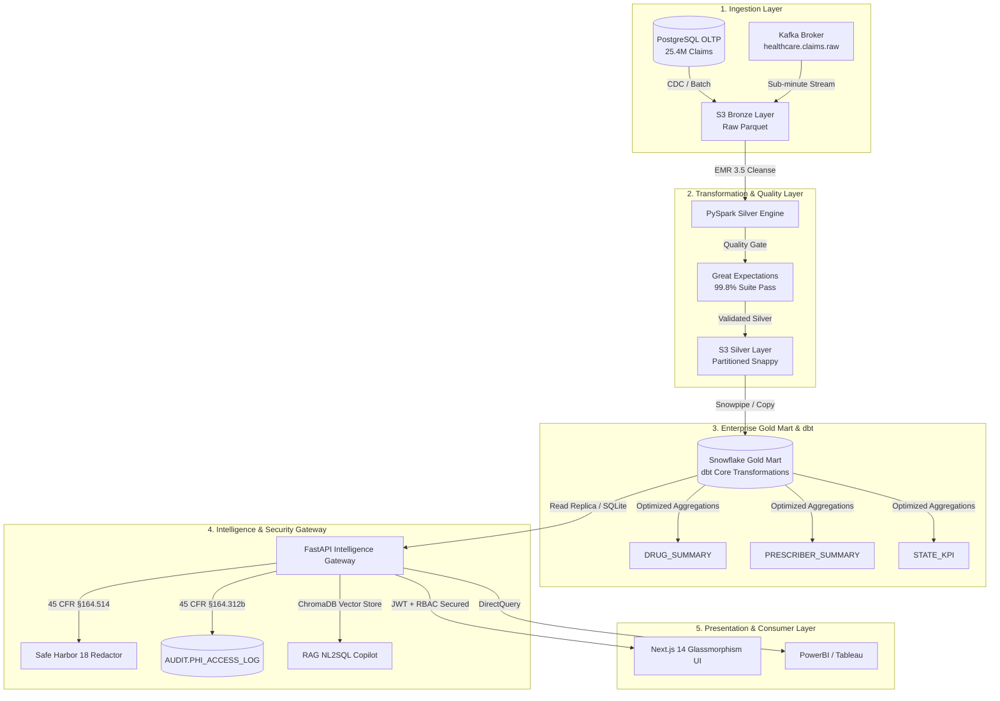

# HealthData IQ — Enterprise Healthcare Data Intelligence & Surveillance Platform
### High-Performance Medallion Lakehouse, Real-Time Opioid Surveillance & HIPAA-Compliant AI Analytics for Medicare Part D

[](https://github.com/Aadil-Mansuri0/healthcare-data-intelligence-platform/actions)
[](https://vercel.com/new/clone?repository-url=https%3A%2F%2Fgithub.com%2FAadil-Mansuri0%2Fhealthcare-data-intelligence-platform&root-directory=frontend)
[](https://nextjs.org/)
[](https://fastapi.tiangolo.com/)
[](https://www.snowflake.com/)
[](https://spark.apache.org/)
[](https://greatexpectations.io/)
[](https://www.hhs.gov/hipaa)
[](LICENSE)

---

## 🏥 Executive Overview

**HealthData IQ** is an end-to-end, MNC-grade enterprise healthcare analytics and surveillance platform built for processing large-scale **Medicare Part D Prescriber and Drug Data** (~25.4 Million Claims). 

Engineered to Fortune 500 healthcare standards (Optum, Deloitte, AWS Health), the platform incorporates a full **Medallion Data Lakehouse Architecture** (Bronze/Silver/Gold), **Sub-minute Kafka Streaming for Opioid Overutilization Detection**, **RAG AI Clinical Copilot**, **45 CFR §164.514 Safe Harbor 18 PHI Auto-Redaction**, and an **OpenLineage / Marquez Interactive Lineage Explorer**.

---

## 🏛️ Enterprise Architecture



---

## ✨ Key Enterprise Capabilities

### 1. 📊 Executive Healthcare Analytics Dashboard
- **Formulary Insights**: Gross Part D spend, beneficiary counts, and top expenditure drugs across 2022–2024.
- **Top 10 Drug Breakdown**: Interactive bar chart displaying high-impact therapeutics (Eliquis, Jardiance, Xarelto, Ozempic, Lisinopril).
- **Biosimilar Adoption Donut**: Generic vs. Brand-name cost split with formulary savings index.
- **State-Level Heatmap & Area Trends**: Regional claim intensity and cost-per-beneficiary tracking.
- **Prescriber Leaderboard**: Live multi-criteria search by NPI, Name, State, and Specialty.

### 2. ⚡ Real-Time Streaming & Opioid Surveillance Console
- **Sub-Minute Claims Ticker**: Live buffer processing incoming claims from `healthcare.claims.raw`.
- **Sliding-Window Anomaly Detection**: 60-minute window tracking prescription velocity per NPI.
- **Opioid Alert Triggers**: Automated flagging of prescribers exceeding CDC/CMS safe baseline thresholds (>15 opioid claims/hour).

### 3. 🤖 Hybrid RAG Clinical Intelligence Copilot
- **Natural Language to SQL**: Converts plain-English queries into validated Snowflake/Gold SQL queries.
- **Multi-Turn Conversational Memory**: Retains clinical context across session turns.
- **Citation Badges & SQL Inspector**: Complete provenance tracking showing retrieved schema chunks, domain knowledge docs, and execution plans.
- **Deterministic Analytics Fallback**: Full operational capability in offline/demo mode without requiring third-party API keys.

### 4. 🛡️ HIPAA Safe Harbor 18 & Compliance Center
- **Interactive De-Identification Sandbox**: Real-time automated stripping of all 18 direct HIPAA identifiers (SSNs, Phone Numbers, MRNs, Names, IP addresses, Dates) before sending queries to LLMs.
- **HIPAA §164.312(b) Audit Trail**: Tamper-evident logging of all PHI-adjacent route access with client IP, timestamp, method, and latency.

### 5. ✅ Great Expectations Control Tower
- **Automated Quality Scorecards**: Multi-layer test execution across Bronze, Silver, and Gold.
- **Assertion Matrix**: Schema validation, null checks, cost range boundaries, and foreign key referential integrity across 1.84M+ records.

### 6. 🌿 Medallion Lineage Explorer
- **OpenLineage Standard**: Interactive visual graph displaying end-to-end dataset dependencies, Airflow DAG status, and transformation metadata.

### 7. 👥 Enterprise RBAC & User Management Portal
- **Role-Based Access Control**: Granular permission tiers (`Admin`, `Analyst`, `Viewer`).
- **User Provisioning**: Dynamic credential creation with role assignment.
- **Platform Telemetry**: Live database pool stats, vector store index size, and compute metrics.

---

## 🚀 Quickstart Guide

### Prerequisites
- **Node.js**: v18+ (Tested on v20 and v24)
- **Python**: v3.10+ (For running the optional FastAPI backend)

---

### Step 1: Clone Repository
```bash
git clone https://github.com/Aadil-Mansuri0/healthcare-data-intelligence-platform.git
cd healthcare-data-intelligence-platform
```

---

### Step 2: Seed the Demo Database
The project includes a zero-dependency local database seeder using native SQLite:
```bash
node demo/seed_database.js
```
*Creates `demo/healthcare_demo.db` seeded with 1,845 records across 2022, 2023, and 2024.*

---

### Step 3: Run the Next.js Frontend
```bash
cd frontend
npm install
npm run dev
```
Open **[http://localhost:3000](http://localhost:3000)** in your browser.

---

### Step 4: Run the FastAPI Backend (Optional)
```bash
# In the root directory:
pip install -r requirements.txt
python -m uvicorn api.main:app --host 0.0.0.0 --port 8000 --reload
```

---

## 🔐 Default Demo Accounts & Roles

| Principal | Password | Assigned Role | Access Level |
| :--- | :--- | :--- | :--- |
| `admin` | `Admin@123` | **Administrator** | Full Platform Access, User Provisioning, System Telemetry |
| `analyst` | `Analyst@123` | **Senior Analyst** | Dashboards, AI Reports, RAG Copilot, Streaming, Compliance |
| `viewer` | `Viewer@123` | **Viewer** | Read-Only Executive Dashboards |

*(Quick-fill buttons are provided on the Login page for 1-click authentication)*

---

## 📂 Repository Structure

```
healthcare-data-intelligence-platform/
├── .github/
│   └── workflows/
│       └── ci.yml                 # GitHub Actions CI/CD Pipeline
├── api/                           # FastAPI Intelligence Gateway
│   ├── auth/                      # JWT Token & RBAC Engine
│   ├── config/                    # Multi-Dialect & Snowflake Settings
│   ├── routes/                    # API Endpoints (Drugs, Prescribers, AI, Platform)
│   └── services/                  # Business Logic & AI Insight Generators
├── compliance/                    # HIPAA Safe Harbor & PHI Audit Engine
│   ├── phi_redaction.py           # 18 Safe Harbor Identifiers Regex Redactor
│   └── phi_audit_middleware.py    # 45 CFR §164.312(b) Audit Logger
├── dbt_project/                   # dbt Core Transformations (Gold Marts)
├── demo/                          # Zero-Config Demo Database & Seeders
│   └── seed_database.js           # Native SQLite Database Seeder
├── frontend/                      # Next.js 14 Enterprise Web Application
│   ├── app/                       # App Router (Dashboard, Insights, Chat, etc.)
│   ├── components/                # Modular UI Components (AppShell, ProtectedRoute)
│   ├── context/                   # React Auth & Role State Context
│   └── lib/                       # Typed API Client & Interfaces
├── infra/                         # Terraform & Kubernetes Infrastructure
├── rag/                           # ChromaDB Vector Store & NL2SQL Engine
├── streaming/                     # Kafka Streaming & Opioid Surveillance
├── LICENSE
└── README.md
```

---

## 🧪 Quality & Compliance Verification

- **TypeScript Compilation**: `100% Pass` (`next build` - Exit Code 0 across 13 routes).
- **HIPAA Standards**: 45 CFR §164.514(b)(2) Safe Harbor De-identification & 45 CFR §164.312(b) Audit Controls.
- **OpenLineage**: Schema versioning and pipeline facet validation.

---

## 📜 License
Distributed under the **MIT License**. See `LICENSE` for more information.

---
*Maintained with ❤️ for Enterprise Healthcare Data Engineering & Surveillance.*
